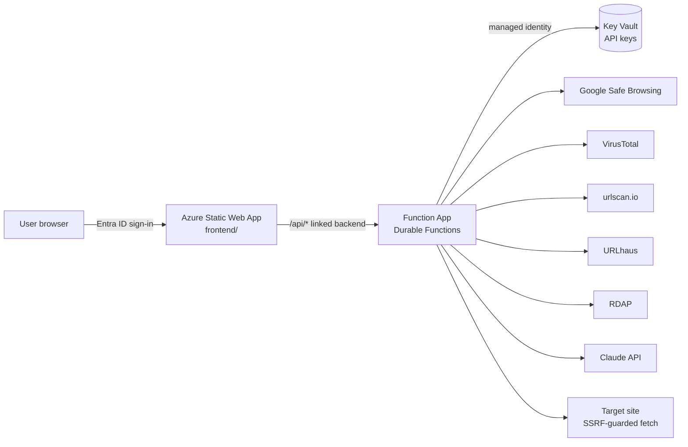

# URL Safety Scanner

A web app where you enter a URL and get a **SAFE / UNSAFE** determination and a downloadable **PDF report**. It checks three things:

1. **Malicious?** The URL is checked against Google Safe Browsing, VirusTotal, urlscan.io (a sandboxed browser scan) and abuse.ch URLhaus. Domain age (RDAP), TLS validity and redirects are also checked.
2. **File sharing capability?** Evidence comes from known-service lists, security-vendor site categories, upload fields and upload libraries on the page, embedded storage/transfer services, direct file downloads, and an AI classifier.
3. **Uses AI?** Evidence comes from known AI services, calls to AI inference APIs, embedded AI chatbot widgets, technology fingerprints, vendor categories, and the AI classifier.

All checks are automated. Provider API keys are stored in Azure Key Vault and read by the Function App's managed identity.

## Architecture



Static Web Apps cuts off API requests after **45 seconds**, but sandbox scans and fresh VirusTotal analyses take 1–3 minutes. The scan therefore runs as a **Durable Functions orchestration**:

| Endpoint | Purpose |
|---|---|
| `POST /api/scan` `{ "url": "..." }` | Validates the URL, starts a scan, returns `{ id }` (202) |
| `GET /api/scan/{id}` | Progress for each check; the report once completed |
| `GET /api/scan/{id}/report` | The PDF report (download) |

The orchestration runs in two phases:
1. All six checks run in parallel, and progress updates as each one finishes.
2. The Claude classifier runs on the page content collected in phase 1.

A final activity then computes the verdict. Users can only read scans they started themselves (checked against the SWA `x-ms-client-principal`).

## Determination rules

The URL is **UNSAFE** if any of the following is true, and **SAFE** otherwise:

- Any reputation source (Safe Browsing, VirusTotal, urlscan.io, URLhaus) returns a **malicious** verdict.
  - VirusTotal: at least `VT_MALICIOUS_THRESHOLD` engines (default 2).
  - URLhaus: the URL is listed and currently online.
- Fewer than `MIN_REPUTATION_SOURCES` (default 2) reputation sources responded. The check **fails closed**: if the URL can't be verified, it's not approved.
- File sharing is detected and `POLICY_BLOCK_FILE_SHARING=true` (the default).
- AI usage is detected and `POLICY_BLOCK_AI=true` (the default).

**Capability scoring:** each signal is weighted *strong* = 3, *medium* = 2 or *weak* = 1. A capability counts as detected at a score of 3 or more, and as high confidence at 5 or more. Page wording (keywords) adds at most 2 points, so marketing text alone can never trigger a detection.

Some findings are reported as **warnings** but don't change the determination on their own:
- VirusTotal suspicious hits
- Domains registered fewer than 30 days ago
- Invalid TLS certificates
- Plain HTTP
- Cross-domain redirects
- Login forms

To change the lists of file-sharing and AI services, APIs and widgets, edit [api/src/lib/signatures.js](api/src/lib/signatures.js).

## API keys

| Key Vault secret name | Provider | Get a key | Notes |
|---|---|---|---|
| `google-safe-browsing-api-key` | Google Safe Browsing v4 | Google Cloud console → enable *Safe Browsing API* → create API key | The free Lookup API is for **non-commercial** use. For commercial use, switch to Google **Web Risk**. |
| `virustotal-api-key` | VirusTotal v3 | virustotal.com → sign up → API key | The free public API allows 4 requests/min and 500/day, and its terms prohibit commercial use. Use a Premium key in production. |
| `urlscan-api-key` | urlscan.io | urlscan.io → Settings & API | Scans are `unlisted` by default (`URLSCAN_VISIBILITY`). `private` requires a paid plan. |
| `urlhaus-auth-key` | abuse.ch URLhaus | auth.abuse.ch → Auth-Key | Free. |
| `anthropic-api-key` | Claude (content classifier) | platform.claude.com → API keys | Uses `claude-opus-5` by default (`ANTHROPIC_MODEL`). |

RDAP needs no key. A provider without a key is reported as **"Not configured"** in the report. If fewer than `MIN_REPUTATION_SOURCES` reputation providers are configured, every scan comes back UNSAFE.

## Deploy to Azure

**Prerequisites:**
- Azure CLI (`az login`)
- Node.js 20+
- Azure Functions Core Tools v4
- SWA CLI (`npm i -g @azure/static-web-apps-cli`)

**Steps:**

1. **Create an Entra ID app registration** for sign-in:
   ```powershell
   $app = az ad app create --display-name "URL Safety Scanner" --sign-in-audience AzureADMyOrg --enable-id-token-issuance true | ConvertFrom-Json
   $secret = az ad app credential reset --id $app.appId --append --query password -o tsv
   ```
2. **Provision and deploy** (Bicep, then Function App publish, then SWA deploy):
   ```powershell
   ./scripts/deploy.ps1 -ResourceGroup rg-urlscanner -Location eastus2 -EntraClientId $app.appId -EntraClientSecret $secret
   ```
   This creates:
   - Storage
   - App Insights and Log Analytics
   - Key Vault (RBAC)
   - Function App (Windows Consumption, Node 22, system-assigned identity with **Key Vault Secrets User**)
   - Static Web App (**Standard** SKU, which linked backends require)
   - The backend link

   The script also grants you **Key Vault Secrets Officer** so you can load keys.
3. **Add the redirect URI** that the script prints (`https://<swa-host>/.auth/login/aad/callback`) to the app registration:
   ```powershell
   az ad app update --id $app.appId --web-redirect-uris https://<swa-host>/.auth/login/aad/callback
   ```
4. **Load the API keys** into Key Vault. The script prompts for each one; press Enter to skip:
   ```powershell
   ./scripts/set-secrets.ps1 -KeyVaultName <kv-name-from-output>
   ```

Linking the Function App to the Static Web App also restricts the Function App so it only accepts traffic routed through the Static Web App. The site and API require an authenticated user from your tenant (see [frontend/staticwebapp.config.json](frontend/staticwebapp.config.json)).

## Continuous deployment (GitHub Actions)

[.github/workflows/deploy.yml](.github/workflows/deploy.yml) runs the tests on every push and pull request. On pushes to `main` it also deploys the Function App and the Static Web App.

The workflow signs in to Azure with **OpenID Connect**, so no Azure credentials are stored in GitHub. A one-time setup creates the pipeline identity. Run it after the infrastructure exists (step 2 above):

```powershell
./scripts/setup-github-oidc.ps1 -ResourceGroup rg-urlscanner -Repo securitymike/url-scanner
```

This setup script:
- Creates an Entra app with a federated credential that trusts only `repo:securitymike/url-scanner:ref:refs/heads/main`.
- Grants it **Website Contributor** on the Function App and **Contributor** on the Static Web App. It gets no other access.
- Sets the repository variables (`AZURE_CLIENT_ID`, `AZURE_TENANT_ID`, `AZURE_SUBSCRIPTION_ID`, and the resource names).

The deploy job skips itself until those variables exist. Infrastructure changes (`infra/main.bicep`) are still deployed by hand with `deploy.ps1`, so the pipeline never gets permission to create role assignments.

## Configuration (Function App settings)

| Setting | Default | Meaning |
|---|---|---|
| `KEY_VAULT_URL` | set by Bicep | Vault to read secrets from. Env vars with the same key names are only a local-dev fallback. |
| `POLICY_BLOCK_FILE_SHARING` | `true` | File sharing capability ⇒ UNSAFE |
| `POLICY_BLOCK_AI` | `true` | AI usage ⇒ UNSAFE |
| `MIN_REPUTATION_SOURCES` | `2` | Minimum responding reputation sources (fail closed) |
| `VT_MALICIOUS_THRESHOLD` | `2` | VirusTotal engines needed for a malicious verdict |
| `VT_MAX_REPORT_AGE_DAYS` | `7` | Older VirusTotal reports trigger a rescan |
| `NEW_DOMAIN_DAYS` | `30` | Domain-age warning threshold |
| `URLSCAN_VISIBILITY` | `unlisted` | `public` / `unlisted` / `private` |
| `DIRECT_FETCH_ENABLED` | `true` | Whether the Function App fetches the page itself (in addition to urlscan.io) |
| `ANTHROPIC_MODEL` / `ANTHROPIC_EFFORT` | `claude-opus-5` / `medium` | Classifier model and effort |

## Local development

```powershell
cd api
copy local.settings.json.example local.settings.json   # add keys directly, or set KEY_VAULT_URL and `az login`
npm install
npm test                                                # unit tests (verdict engine, extraction, URL validation, PDF)
npx azurite --silent                                    # in another terminal: Durable Functions needs storage
func start                                              # API on http://localhost:7071
# in another terminal, from the repo root:
swa start frontend --api-devserver-url http://localhost:7071
```

## Security notes

- **SSRF protection** applies whenever the Function App fetches a page itself:
  - Only http/https on ports 80, 443, 8080 and 8443.
  - Private, loopback, link-local and metadata addresses are blocked. The check runs **at connect time**, so DNS rebinding is covered too.
  - Every redirect hop is re-validated.
  - Responses are capped at 3 MB and 15 s.
- **The scanned site is untrusted.** The UI builds DOM nodes with `textContent` (no `innerHTML`) and never renders the scanned URL as a link. The PDF sanitizes all text. The Claude prompt treats page content as data, not instructions.
- **Raw HTML is never stored.** Only a compact extract (title, script hosts, forms, 20 KB of text) goes into Durable Functions history.

## Limitations

- Results reflect what is visible without logging in. Upload or AI features behind authentication may be missed; the Claude classifier helps infer them from the page's description of the product.
- Some sites block automated fetches. urlscan.io's real-browser scan and DOM snapshot are the main content source; the direct fetch is a fallback.
- Scans take 1–3 minutes, mostly waiting on the urlscan.io sandbox and VirusTotal queueing.
